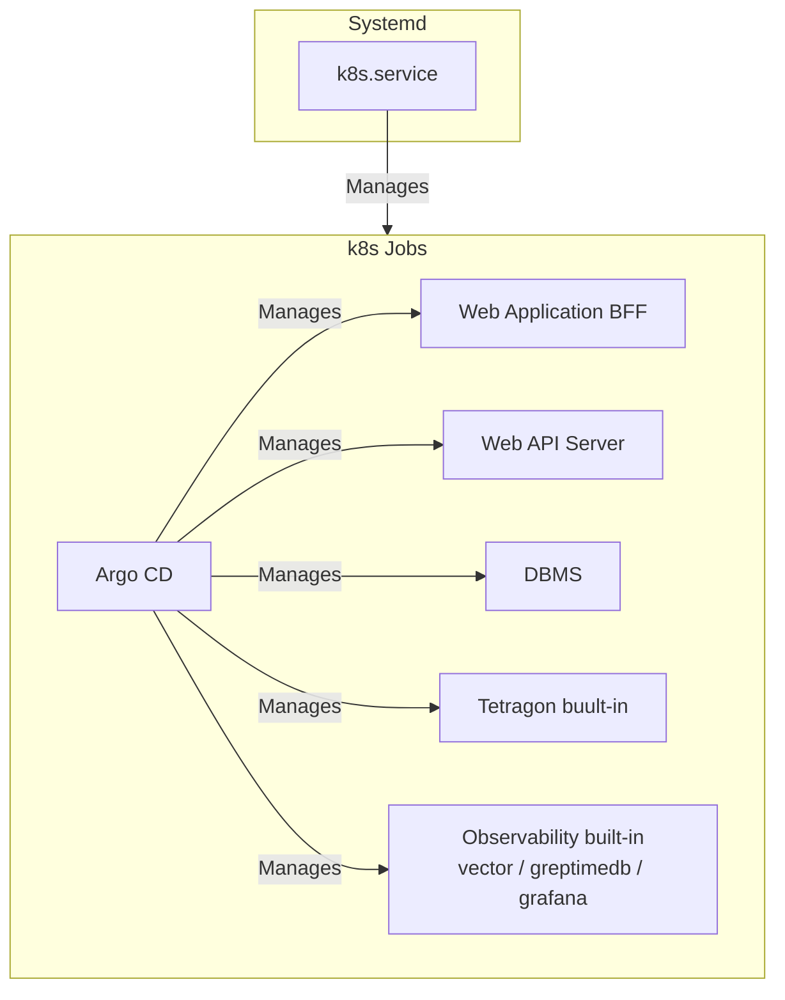

# sakura-talos-argocd

さくらのクラウド上に Talos Linux, ArgoCD をインストールする

## アーキテクチャ

- さくらのクラウド上に構築する
- OS には Talos Linux を使用する
- 3台のサーバでクラスタを構成する
- 3台のサーバをコントロールプレーン兼ワーカとしてセットアップする
- クラスタのサーバ間通信のための内部ネットワークを運用する
- k8s に Argo CD を入れて、 Helm チャートを管理する
- ロードバランサを使用してグローバルIPで着信した HTTP リクエストをサービスが動作しているワーカに振り分ける
- ロードバランサの設定をコントローラから行うさくらのクラウド用 CCM を開発してインストールする
- eBPF として Tetragon を導入する
- ログの解析のために vector, greptimeDB, grafana を導入する
- サーバへの SSH 接続や k8s API へのアクセスは、パケットフィルタでポートを開放せず AWS SSM Agent (Systems Manager Session Manager) 経由で行う

## 構築ツール

IaC のツールとしては、Terraform, Ignition(Butane), Ansible を使用する。

### パラメータ

パラメータはすべて Codespace の環境変数から取得する。以下にパラメータの一覧を示す。

|環境変数名|意味|例|デフォルト/必須|
|--|--|--|--|
|AWS_ACCESS_KEY_ID|SSM Agent 登録・操作用に AssumeRole する IAM ユーザー (Switch Only) のアクセスキー|AKIAX..X14|必須|
|AWS_SECRET_ACCESS_KEY|上記アクセスキーのシークレット|23DF..X14|必須|
|AWS_ROLE_ARN|SSM Agent のアクティベーション発行や Session Manager 操作のために AssumeRole するロールの ARN|arn:aws:iam::123456789012:role/SSMAgentProvisioner|必須|
|AWS_REGION|SSM Agent を登録する AWS リージョン|ap-northeast-1|必須|
|SAKURA_ACCESS_TOKEN|さくらのクラウドのAPIキーのアクセストークン|23DF..X14|必須|
|SAKURA_ACCESS_TOKEN_SECRET|さくらのクラウドのAPIキーのアクセストークンのシークレット|23DF..X14|必須|
|CLOUDFLARE_ACCOUNT_ID|Cloudflare のアカウントID|be591f7..c14|必須|
|CLOUDFLARE_ACCESS_TOKEN|Cloudflare API アクセストークン (Zone:Read + DNS:Edit 権限)|cfat_v..x14|必須|
|SAKURA_LABEL_PREFIX|サーバのラベルのプリフィックス。この後ろに -sv1, -sv2, -sv3 を結合してサーバのラベルを付与する。これはホスト名と一致させる。|ops-frontier|ops-frontier|
|SAKURA_REGION|さくらのクラウドの配置先リージョン。|is1c|is1c|
|SAKURA_SERVER_CPU|さくらのクラウドのサーバのCPU数|4|2|
|SAKURA_SERVER_MEMORY|さくらのクラウドのサーバのメモリサイズ(GB)|8|4|
|SAKURA_SERVER_COMMITMENT|さくらのクラウドのサーバの占有度|dedicatedcpu|standard|
|SAKURA_SERVER_CPU_MODEL|さくらのクラウドのサーバのCPUモデル|amd_epyc_7713p|uncategorized|
|DOMAIN|Cloudflare で管理するゾーン名|example.com|必須|
|LE_ENVIRONMENT|Let's Encrypt の環境 (production または staging)|staging|production|
|GH_ORGANIZATION|Github の組織のID |ops-frontier|chip-in-v2|
|GH_CLIENT_ID_GRAFANA|Github ClientID Grafana用||必須|
|GH_CLIENT_SECRET_GRAFANA|Github Secret Grafana用||必須|
|GH_CLIENT_ID_ARGOCD|Github ClientID ArgoCD用||必須|
|GH_CLIENT_SECRET_ARGOCD|Github Secret ArgoCD用||必須|
|AUTO_SHUTDOWN_AT_UTC|毎日自動シャットダウンする時刻 (UTC)。systemd OnCalendar 形式 (例: `11:00:00` = 20:00 JST)。未設定の場合は自動シャットダウンなし。|11:00:00|なし|

なお、環境変数は CodeSpaces から設定できるようにするため、大文字でなければならない。terraform で利用する変数については TF_VAR_ で始まる環境変数に  postCreateCommand で転記する。

### サーバとネットワーク

terraform でサーバを3台を SAKURA_REGION で指定されたリージョンに構築する。各サーバには以下の2枚のディスクを接続する。

- **ブートストラップディスク (20GB)**: Ubuntu 22.04 LTS パブリックアーカイブから作成。ディスク修正 API でグローバル IP と SSH 公開鍵を設定して起動する。Flatcar のインストール作業環境として使用する。
- **ターゲットディスク (40GB)**: 未フォーマットの SSD。`flatcar-install` で Flatcar Container Linux をインストールする先。

さくらのクラウドの API でディスクの順序を入れ替えることで、Ubuntu と Flatcar のどちらから起動するかを選択できる。これにより、サーバを再構築せずに Ignition 設定をデバッグできる。

セキュリティ向上のため、さくらのクラウドのパケットフィルタを構成し、サーバのパブリックIPには**ポート 80 (HTTP) と 443 (HTTPS) のみ**オープンにするようにアクセス制限をかける。SSH接続はデフォルトでは許可されない。

### ssh

ssh のペア鍵は terraform でオンデマンドに生成する。Ubuntu ブートストラップディスクへのインストール作業時 (`build-infra` / `boot`) は、まだ Flatcar 上で SSM Agent が動作していないため、以下の手順で従来どおり鍵ペアによる SSH 接続を行う。

1. 開発環境からインターネットに接続するときのグローバルIPを調べる
2. パケットフィルタで 22 番ポートの tcp 接続を開発環境の IP のみ許可する
3. `~/.ssh/config` を生成し、サーバ名でアクセスできるようにする

Flatcar 起動後は SSM Agent がサーバ上で稼働するため、以降のサーバへの SSH 接続や k8s API (6443) へのアクセスは AWS SSM Session Manager 経由で行う (詳細は [SSM-AGENT.md](./SSM-AGENT.md) を参照)。`~/.ssh/config` の `ProxyCommand` が SSM 経由の接続をトンネルするため、パケットフィルタで SSH 用ポートを開放する必要がない。

config では `${SAKURA_LABEL_PREFIX}-sv1`, `${SAKURA_LABEL_PREFIX}-sv2`, `${SAKURA_LABEL_PREFIX}-sv3` のホスト名でアクセスできるようにする。

### 初期インストール

初期インストールは Flatcar Container Linux でデフォルトでサポートされている Ignition を使用する。Ignition の内容については Butane を使用して [YAML](./butane/node.yaml.j2) で記述する。`boot` がテンプレートから各サーバ用の Ignition ファイルを生成し、Ubuntu 上で `flatcar-install` を実行してターゲットディスクにインストールする。インストール完了後、ディスク順序を入れ替えて Flatcar から起動する。

### ミドルウェア

サーバに k8s を systemd 管理のサービスとしてインストールする。k8s でクラスタを構成し、コンテナのオーケストレーションを行う。

- 全サーバをコントロールプレーン兼ワーカノードとする
- Embeded DB を全サーバにインストールしクラスタ化する
- k8s のHelmチャート管理には Argo CD を使用する



### 操作コマンド

ターミナルから使用できる構築作業に便利なコマンドを用意している。以下のコマンドを post-create.sh で ~/.bashrc に alias を登録し、 ansible-playbook コマンドで playbook を実行するようになっている。

|コマンド|説明|playbook パス|
|--|--|--|
|build-infra|さくらのクラウドのネットワークとサーバを構築|ansible/playbooks/build-infra.yml|
|boot|flatcar linux と k8s をインストール|ansible/playbooks/boot.yml|
|install-charts|インフラ系のリソースを k8s に組み込む|ansible/playbooks/install-infra-apps.yml|
|push-infra-apps|インフラ系のアプリの Helmチャートをコンテナレジストリに Push|ansible/playbooks/push-infra-apps.yml|
|allow-ssh|SSM Session Manager 経由の k8s API (6443) 用ポートフォワードをバックグラウンドで開始する|ansible/playbooks/allow-ssh.yml|
|deny-ssh|allow-ssh で開始した SSM ポートフォワードセッションを停止する|ansible/playbooks/deny-ssh.yml|
|destroy|さくらのクラウドのネットワークとサーバを削除|ansible/playbooks/destroy.yml|
|build-all|build-infra, boot, install-infra-apps を順に実行する|ansible/playbooks/build-all.yml|
|shutdown-servers|サーバをすべてシャットダウンする|ansible/playbooks/shutdown-servers.yml|
|startup-servers|サーバをすべて起動する|ansible/playbooks/startup-servers.yml|

### Helmチャート管理

Argo CD を導入して Helm チャートを管理する。 Helm チャートはインフラ層には稼働監視と eBPF が組み込みチャートとしてインストールされる。
組み込みチャートはさくらインターネットのコンテナレジストリに登録される。チャート登録用のコンテナレジストリは terraform によって作成される。
コンテナレジストリのユーザも terrafom によって作成される。
Argo CD を動作させる前に稼働監視とeBPF のチャートをビルドし、コンテナレジストリに push しておく。ArgoCDにはコンテナレジストリのタグを登録する。登録後 OCI でチャートを pull して初期化する。

### 稼働監視

稼働監視のための vector / greptimedb / grafana が組み込まれており、障害検知、フォレンジックに利用可能である。

#### 解析と蓄積

vector でログとメトリックスを集めて稼働監視を行う。
- ログの解析のために vector, greptimeDB, grafana を導入する
- vector は containerd、k8sデーモンを含むOSレベルのログ、Tetragon のログ、各コンテナのログを収集する
- ログを出力するデーモン、コンテナはできる限り JSON フォーマットのログを出力するように設定する
- grafana のダッシュボードには各種ログを俯瞰できるものを掲載する
- grafana には admin ユーザを環境変数で指定したパスワードで登録しておく
- vector, greptimedb, grafana の設定情報は Helmチャートの ConfigMap から収集され、コントローラによって動的に構成される

### eBPF
eBPF の Tetragon が組み込まれており、サーバでシステムコールレベルの監視を行う。
Tetragonのログを稼働監視で収集できるように Chart の ConfigMap に vector, greptimeDB, grafana の設定を入れる。稼働監視のコントローラでこれを発見してオンデマンドでログが収集されるようにする。

### アップデート

- OS については Flatcar Conatainer Linux の Automated update を使用して行う
- k8s については Rancher（SUSE）の公式ツールである System Upgrade Controller（SUC） をKubernetesクラスタ内にデプロイして更新する
- OS と k8s の更新のタイミングを揃えることでセキュリティパッチのためのコンテナ再起動回数を最小限にする

## 構築手順

### 1. 事前準備（サービスのサインアップとパラメータ収集）

本手順を開始する前に、以下のサービスへの登録と設定値の取得が必要です。

1. **さくらのクラウド**
   - アカウントを作成し、課金設定を完了します。
   - [API キー](https://secure.sakura.ad.jp/cloud/?#/apikeys) から API キーを生成し、その鍵とシークレットを控えておきます。
   - 委譲するドメイン名 (`DOMAIN`) を決定します (例: `coder.example.com` など)。
2. **DNS の設定**
   - Cloudflare の管理画面から対象のドメイン (`DOMAIN`) のゾーンを確認します。
   - Cloudflare の「My Profile」 > 「API Tokens」から API トークンを作成します。
   - トークンには **Zone:Read** および **DNS:Edit** の権限を付与してください。
   - アカウント ID (「Accounts」 > 対象アカウント) と発行した API トークンを控えておきます。
3. **GitHub OAuth アプリケーションの作成**
   - GitHub の `Settings` > `Developer settings` > `OAuth Apps` に移動します。
   - ArgoCD 用の `New OAuth App` を作成します。
     - Homepage URL: `https://argocd.poc.${DOMAIN}` (例: `https://argocd.poc.example.com`)
     - Authorization callback URL: `https://argocd.poc.${DOMAIN}/api/dex/callback`
   - 生成された **Client ID** を `GH_CLIENT_ID_ARGOCD`、**Client Secret** を `GH_CLIENT_SECRET_ARGOCD` として控えます。
   - Grafana 用の `New OAuth App` を作成します。
     - Homepage URL: `https://grafana.poc.${DOMAIN}` (例: `https://grafana.poc.example.com`)
     - Authorization callback URL: `https://grafana.poc.${DOMAIN}/login/github`
   - 生成された **Client ID** を `GH_CLIENT_ID_GRAFANA`、**Client Secret** を `GH_CLIENT_SECRET_GRAFANA` として控えます。
4. **AWS (SSM Agent 用 IAM ユーザー / ロール)**
   - サーバへの SSH 接続や k8s API へのアクセスを AWS SSM Session Manager 経由で行うため、AWS アカウント上に IAM ユーザーとロールを準備します。
   - 詳細な手順は [SSM-AGENT.md](./SSM-AGENT.md) を参照してください。
   - Codespaces から AssumeRole 専用で使用する IAM ユーザー (`codespace-access`) のアクセスキー (`AWS_ACCESS_KEY_ID` / `AWS_SECRET_ACCESS_KEY`) と、SSM 操作用のロール (`SSMAgentProvisioner`) の ARN (`AWS_ROLE_ARN`) を控えておきます。

### 2. GitHub Codespaces の起動と環境変数設定

1. 対象のリポジトリ（本リポジトリ）の Settings ページから `Secrets and variables` > `Codespaces` を開き、以下の環境変数 (Secrets) を登録します。

   - `AWS_ACCESS_KEY_ID`: AssumeRole 専用 IAM ユーザーのアクセスキー (必須)
   - `AWS_SECRET_ACCESS_KEY`: 上記アクセスキーのシークレット (必須)
   - `AWS_ROLE_ARN`: SSM Agent 登録・操作用に AssumeRole するロールの ARN (必須)
   - `AWS_REGION`: SSM Agent を登録する AWS リージョン (必須)
   - `SAKURA_ACCESS_TOKEN`: さくらのクラウド API キーのアクセストークン (必須)
   - `SAKURA_ACCESS_TOKEN_SECRET`: さくらのクラウド API キーのアクセストークンのシークレット (必須)
   - `CLOUDFLARE_ACCOUNT_ID`: Cloudflare アカウント ID (必須)
   - `CLOUDFLARE_ACCESS_TOKEN`: Cloudflare API アクセストークン (必須)
   - `DOMAIN`: Cloudflare で管理するゾーン名 (必須。例: `example.com`)
   - `GH_CLIENT_ID_ARGOCD`: GitHub OAuth アプリの Client ID (必須)
   - `GH_CLIENT_SECRET_ARGOCD`: GitHub OAuth アプリの Client Secret (必須)
   - `GH_CLIENT_ID_GRAFANA`: GitHub OAuth アプリの Client ID (必須)
   - `GH_CLIENT_SECRET_GRAFANA`: GitHub OAuth アプリの Client Secret (必須)
   - (その他、Readme上部の「パラメータ」表にある値を必要に応じて設定)

2. リポジトリの画面に戻り、`Code` > `Codespaces` から新しい Codespace を起動します。
   - `.devcontainer/devcontainer.json` に基づいて自動的に Terraform、Ansible、k8s がインストールされた環境が立ち上がります。
   - `post-create.sh` により各 Ansible playbook の alias が `~/.bashrc` に設定され、playbook 名（拡張子なし）のコマンドが使えるようになります。
   - 上記で設定した環境変数は、すべて `TF_VAR_` プレフィックスが付与されて Terraform 用の変数として自動認識されます。

### 3. Terraform 初期化
```bash
cd terraform && terraform init && cd ..
```

### 4. インフラ構築

Ubuntu サーバのプロビジョニング、SSH パケットフィルタの設定、`flatcar-install` のインストールを行う。

```bash
build-infra
```

### 5. Flatcar Linux のインストールと起動

各サーバに Ignition ファイルを生成して Flatcar をインストールし、再起動する。k8s と ArgoCD は起動後に自動インストールされる。

```bash
boot
```

### 6. クラスタの確認

インストールには数分かかる。サーバ起動後は Flatcar 上の SSM Agent が AWS に登録され、以下の `ssh` は `~/.ssh/config` の `ProxyCommand` により AWS SSM Session Manager 経由で接続される (パケットフィルタで SSH ポートを開放する必要はない)。

```bash
ssh core@<SAKURA_LABEL_PREFIX>-sv1
sudo journalctl -u install-k8s.service -f     # k8s インストールログ
sudo journalctl -u install-argocd.service -f  # ArgoCD インストールログ (sv1 のみ)
```

ArgoCD の Pod が起動していることを確認する。

```bash
export KUBECONFIG=/etc/rancher/k8s/k8s.yaml
kubectl get pods -n argocd
kubectl get nodes
```

### 7. ArgoCD ブートストラップ (install-infra-apps)

YAML テンプレートをレンダリングし、`~/.kube/config` を設定した上で ArgoCD に App of Apps と各種マニフェストを適用する。このコマンドは Codespace から実行する。

```bash
install-infra-apps
```

実行内容:
1. `argocd/manifests/*.yaml.j2` および `argocd/apps/infra-apps.yaml.j2` を Jinja2 でレンダリングし `rendered/` に出力
2. sv1 から kubeconfig を取得して `~/.kube/config` に保存 (context: `sakura-k8s`)
3. 以下のマニフェストを `kubectl apply`:
   - `rendered/bootstrap.yaml` — ArgoCD AppProject + App of Apps
   - `rendered/infra-apps.yaml` — cert-manager / traefik / tetragon 等の Application 定義
   - `rendered/argocd-config.yaml` — GitHub OAuth + Ingress 設定
   - `rendered/cert-manager-issuers.yaml` — Let's Encrypt ClusterIssuer + DigitalOcean DNS トークン
   - `rendered/grafana-oauth-secret.yaml` — Grafana GitHub OAuth Secret

適用後は ArgoCD が cert-manager / traefik / tetragon などを自動デプロイする。進捗は以下で確認できる。

```bash
export KUBECONFIG=~/.kube/config
kubectl get applications -n argocd
kubectl get pods -n cert-manager
kubectl get pods -n traefik
```

### 8. k8s API トンネルの停止（オプション）

SSH 接続や k8s API へのアクセスは AWS SSM Session Manager 経由で行われ、パケットフィルタでポートを開放しないため、恒常的な無効化操作は不要である。`allow-ssh` でバックグラウンド起動した k8s API (6443) 用ポートフォワードセッションが残っている場合は、作業完了後に以下で停止しておく。

```bash
deny-ssh
```

### サーバの起動・停止

```bash
startup-servers   # 全サーバを起動
shutdown-servers  # 全サーバをシャットダウン
```

### インフラの削除

```bash
destroy
```

