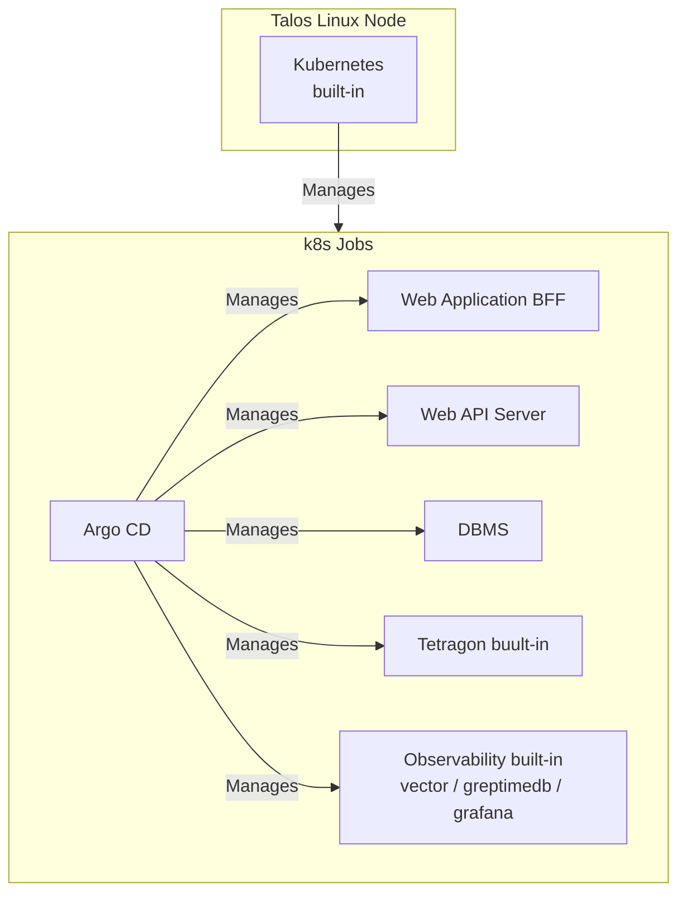
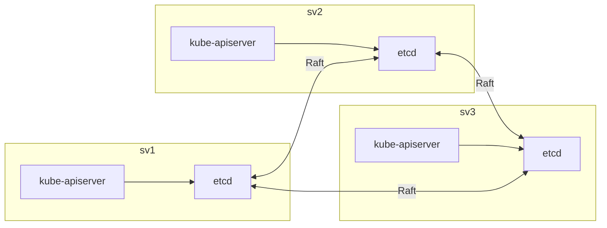
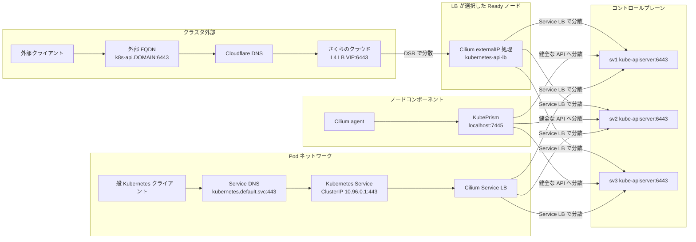

# sakura-talos-argocd

さくらのクラウド上に Talos Linux, ArgoCD をインストールする

## アーキテクチャ

- さくらのクラウド上に構築する
- OS には Talos Linux を使用する
- 3台のサーバでクラスタを構成する
- 3台のサーバをコントロールプレーン兼ワーカとしてセットアップする
- クラスタのサーバ間通信のための内部ネットワークを運用する
- k8s は Talos Linux に組み込みのため別途インストールしない。k8s に Argo CD を入れて、 Helm チャートを管理する
- ロードバランサを使用してグローバルIPで着信した HTTP リクエストをサービスが動作しているワーカに振り分ける
- ロードバランサの設定をコントローラから行うさくらのクラウド用 CCM を開発してインストールする
- eBPF として Tetragon を導入する
- ログの解析のために vector, greptimeDB, grafana を導入する
- サーバは Talos API と Kubernetes API を mTLS で管理する。管理ポートは Ansible 実行元のグローバル IP にのみ許可し、SSH はインストール作業時以外は開放しない

## 構築ツール

IaC のツールとしては、Terraform, Ansible を使用する。ディスクイメージの作成には Sidero Labs 公式 imager コンテナを使用する。

### パラメータ

パラメータはすべて Codespace の環境変数から取得する。以下にパラメータの一覧を示す。

|環境変数名|意味|例|デフォルト/必須|
|--|--|--|--|
|TALOS_VERSION|Talos Linux のバージョン|v1.13.8|v1.13.8|
|KUBERNETES_VERSION|Talos に組み込む Kubernetes のバージョン|v1.31.1|v1.31.1|
|SAKURA_ACCESS_TOKEN|さくらのクラウドのAPIキーのアクセストークン|23DF..X14|必須|
|SAKURA_ACCESS_TOKEN_SECRET|さくらのクラウドのAPIキーのアクセストークンのシークレット|23DF..X14|必須|
|CLOUDFLARE_ACCOUNT_ID|Cloudflare のアカウントID|be591f7..c14|必須|
|CLOUDFLARE_ACCESS_TOKEN|Cloudflare API アクセストークン (Zone:Read + DNS:Edit 権限)|cfat_v..x14|必須|
|SAKURA_LABEL_PREFIX|サーバのラベルのプリフィックス。この後ろに -sv1, -sv2, -sv3 を結合してサーバのラベルを付与する。これはホスト名と一致させる。|ops-frontier|ops-frontier|
|SAKURA_REGION|さくらのクラウドの配置先リージョン。|is1c|is1c|
|SAKURA_SERVER_CPU|さくらのクラウドのサーバのCPU数|4|2|
|SAKURA_SERVER_MEMORY|さくらのクラウドのサーバのメモリサイズ(GB)|8|4|
|SAKURA_SERVER_COMMITMENT|さくらのクラウドのサーバの占有度|dedicatedcpu|standard|
|SAKURA_SERVER_CPU_MODEL|さくらのクラウドのサーバのCPUモデル|amd_epyc_7713p|uncategorized|
|DOMAIN|Cloudflare で管理するゾーン名|example.com|必須|
|LE_ENVIRONMENT|Let's Encrypt の環境 (production または staging)|staging|production|
|GH_ORGANIZATION|Github の組織のID |ops-frontier|chip-in-v2|
|GH_CLIENT_ID_GRAFANA|Github ClientID Grafana用||必須|
|GH_CLIENT_SECRET_GRAFANA|Github Secret Grafana用||必須|
|GH_CLIENT_ID_ARGOCD|Github ClientID ArgoCD用||必須|
|GH_CLIENT_SECRET_ARGOCD|Github Secret ArgoCD用||必須|
|AUTO_SHUTDOWN_AT_UTC|毎日自動シャットダウンする時刻 (UTC)。systemd OnCalendar 形式 (例: `11:00:00` = 20:00 JST)。未設定の場合は自動シャットダウンなし。|11:00:00|なし|
|CR_FQDN|組み込みチャート/イメージを push・pull するコンテナレジストリの FQDN|registry.example.com|必須|
|CR_USER|コンテナレジストリのユーザID|k8s-user|必須|
|CR_PASSWORD|コンテナレジストリのパスワード|xxxxxxxx|必須|

なお、環境変数は CodeSpaces から設定できるようにするため、大文字でなければならない。terraform で利用する変数については TF_VAR_ で始まる環境変数に  postCreateCommand で転記する。

### サーバとネットワーク

terraform でサーバを3台を SAKURA_REGION で指定されたリージョンに構築する。各サーバには以下の2枚のディスクを接続する。

- **ブートストラップディスク (20GB)**: Ubuntu 22.04 LTS パブリックアーカイブから作成。ディスク修正 API でグローバル IP と SSH 公開鍵を設定して起動する。Talos Linux のインストール作業環境として使用する。
- **ターゲットディスク (40GB)**: 未フォーマットの SSD。公式 imager コンテナで生成した Talos Linux のディスクイメージを `dd` で書き込む先。

さくらのクラウドの API でディスクの順序を入れ替えることで、Ubuntu と Talos のどちらから起動するかを選択できる。これにより、サーバを再構築せずにインストール処理をデバッグできる。

セキュリティ向上のため、さくらのクラウドのパケットフィルタを構成し、サーバのパブリックIPには**ポート 80 (HTTP) と 443 (HTTPS) のみ**オープンにするようにアクセス制限をかける。SSH接続はデフォルトでは許可されない。

### ssh

ssh のペア鍵は terraform でオンデマンドに生成する。Ubuntu ブートストラップディスクへのインストール作業時 (`build-infra` / `boot`) のみ、以下の手順で鍵ペアによる SSH 接続を行う。

1. 開発環境からインターネットに接続するときのグローバルIPを調べる
2. パケットフィルタで 22 番ポートの tcp 接続を開発環境の IP のみ許可する
3. Ubuntu ブートストラップディスクに対して SSH 接続し、Talos Linux のディスクイメージを書き込む

Talos Linux には sshd が存在せず、SSH 接続は一切行わない。Talos 起動後のクラスタ操作は `talosctl` と Kubernetes kubeconfig の mTLS 認証で行う。Ansible は Talos API (50000/tcp) と Kubernetes API (6443/tcp) を実行元 IP に限定して許可し、SSH 許可ルールはブートストラップ完了後に解除する。

config では `${SAKURA_LABEL_PREFIX}-sv1`, `${SAKURA_LABEL_PREFIX}-sv2`, `${SAKURA_LABEL_PREFIX}-sv3` のホスト名でアクセスできるようにする。

### 初期インストール

初期インストールでは、共通 CA とクライアント証明書、ノード固有の machine config を生成する。`boot` が各 Ubuntu 上で公式 imager コンテナを実行し、machine config を埋め込んだ BIOS 対応 metal RAW イメージをターゲットディスクに書き込む。Talos 起動後は `talosctl bootstrap` で etcd を初期化し、Cilium をインストールする。

### ミドルウェア

サーバに Talos Linux 組み込みの k8s でクラスタを構成し、コンテナのオーケストレーションを行う。

- 全サーバをコントロールプレーン兼ワーカノードとする
- Embeded DB を全サーバにインストールしクラスタ化する
- CNI には Cilium を使用する。Cilium は `boot`、Argo CD は `install-infra-apps` がデプロイする
- k8s のHelmチャート管理には Argo CD を使用する



### Kubernetes API

Kubernetes API と etcd は3台のコントロールプレーンで稼働し、 etcd は Raft でリーダ選出を行ってマルチマスタクラスタを組み、複製同期している。



#### 冗長化とアクセス経路

Kubernetes API は3台のコントロールプレーンで稼働し、アクセス元ごとに以下の経路で分散する。

- 外部クライアントは `k8s-api.${DOMAIN}:6443` を使用する。Cloudflare DNS がさくらのクラウド L4 LB の VIP を返し、L4 LB が Ready ノードへ分散する。LB は DSR 方式のため、選択されたノードの Cilium が `kubernetes-api-lb` Service の `externalIPs` として VIP を受け、3台の kube-apiserver endpoint へ分散する。
- Cilium agent は各ノードの `localhost:7445` にある KubePrism を使用する。KubePrism が健全な kube-apiserver を選択する。
- Pod 内の一般的な Kubernetes クライアントは `kubernetes.default.svc:443` を使用する。Service DNS が標準の Kubernetes Service を指し、Cilium Service LB が3台の kube-apiserver endpoint へ分散する。



クラスタ初期構築時は Cilium Service LB がまだ存在しないため、`boot` は Cilium のインストール完了まで一時的に sv1 の公開 IP へ直接接続し、その後に外部 FQDN へ切り替える。

### 操作コマンド

ターミナルから使用できる構築作業に便利なコマンドを用意している。以下のコマンドを post-create.sh で ~/.bashrc に alias を登録し、 ansible-playbook コマンドで playbook を実行するようになっている。

|コマンド|説明|playbook パス|
|--|--|--|
|build-infra|さくらのクラウドのネットワークとサーバを構築|ansible/playbooks/build-infra.yml|
|boot|Talos Linux をインストール (k8s は Talos に組み込みのため別途インストール不要)|ansible/playbooks/boot.yml|
|install-charts|インフラ系のリソースを k8s に組み込む|ansible/playbooks/install-infra-apps.yml|
|push-infra-apps|インフラ系のアプリの Helmチャートをコンテナレジストリに Push|ansible/playbooks/push-infra-apps.yml|
|destroy|さくらのクラウドのネットワークとサーバを削除|ansible/playbooks/destroy.yml|
|build-all|build-infra, boot, install-infra-apps を順に実行する|ansible/playbooks/build-all.yml|
|shutdown-servers|サーバをすべてシャットダウンする|ansible/playbooks/shutdown-servers.yml|
|startup-servers|サーバをすべて起動する|ansible/playbooks/startup-servers.yml|

### Helmチャート管理

Argo CD を導入して Helm チャートを管理する。 Helm チャートはインフラ層には稼働監視と eBPF が組み込みチャートとしてインストールされる。
組み込みチャートは外部のコンテナレジストリに登録される。コンテナレジストリは terraform では構築せず、`CR_FQDN` / `CR_USER` / `CR_PASSWORD` の環境変数で接続先とユーザを指定する。
Argo CD に対して、稼働監視とeBPF のチャートをビルドし、コンテナレジストリに push しておく。ArgoCDにはコンテナレジストリのタグを登録する。登録後 OCI でチャートを pull して初期化する。

### 稼働監視

稼働監視のための vector / greptimedb / grafana が組み込まれており、障害検知、フォレンジックに利用可能である。

#### 解析と蓄積

vector でログとメトリックスを集めて稼働監視を行う。
- ログの解析のために vector, greptimeDB, grafana を導入する
- vector は containerd、k8sデーモンを含むOSレベルのログ、Tetragon のログ、各コンテナのログを収集する
- ログを出力するデーモン、コンテナはできる限り JSON フォーマットのログを出力するように設定する
- grafana のダッシュボードには各種ログを俯瞰できるものを掲載する
- grafana には admin ユーザを環境変数で指定したパスワードで登録しておく
- vector, greptimedb, grafana の設定情報は Helmチャートの ConfigMap から収集され、コントローラによって動的に構成される

### eBPF
eBPF の Tetragon が組み込まれており、サーバでシステムコールレベルの監視を行う。
Tetragonのログを稼働監視で収集できるように Chart の ConfigMap に vector, greptimeDB, grafana の設定を入れる。稼働監視のコントローラでこれを発見してオンデマンドでログが収集されるようにする。

### アップデート

- OS については Talos Linux 組み込みの A/B アトミックアップデートを `talosctl upgrade` で行う
- k8s については `talosctl upgrade-k8s` でバージョンアップを行う
- OS と k8s の更新のタイミングを揃えることでセキュリティパッチのためのコンテナ再起動回数を最小限にする

## 構築手順

### 1. 事前準備（サービスのサインアップとパラメータ収集）

本手順を開始する前に、以下のサービスへの登録と設定値の取得が必要です。

1. **さくらのクラウド**
   - アカウントを作成し、課金設定を完了します。
   - [API キー](https://secure.sakura.ad.jp/cloud/?#/apikeys) から API キーを生成し、その鍵とシークレットを控えておきます。
   - 委譲するドメイン名 (`DOMAIN`) を決定します (例: `coder.example.com` など)。
2. **DNS の設定**
   - Cloudflare の管理画面から対象のドメイン (`DOMAIN`) のゾーンを確認します。
   - Cloudflare の「My Profile」 > 「API Tokens」から API トークンを作成します。
   - トークンには **Zone:Read** および **DNS:Edit** の権限を付与してください。
   - アカウント ID (「Accounts」 > 対象アカウント) と発行した API トークンを控えておきます。
3. **GitHub OAuth アプリケーションの作成**
   - GitHub の `Settings` > `Developer settings` > `OAuth Apps` に移動します。
   - ArgoCD 用の `New OAuth App` を作成します。
     - Homepage URL: `https://argocd.poc.${DOMAIN}` (例: `https://argocd.poc.example.com`)
     - Authorization callback URL: `https://argocd.poc.${DOMAIN}/api/dex/callback`
   - 生成された **Client ID** を `GH_CLIENT_ID_ARGOCD`、**Client Secret** を `GH_CLIENT_SECRET_ARGOCD` として控えます。
   - Grafana 用の `New OAuth App` を作成します。
     - Homepage URL: `https://grafana.poc.${DOMAIN}` (例: `https://grafana.poc.example.com`)
     - Authorization callback URL: `https://grafana.poc.${DOMAIN}/login/github`
   - 生成された **Client ID** を `GH_CLIENT_ID_GRAFANA`、**Client Secret** を `GH_CLIENT_SECRET_GRAFANA` として控えます。
### 2. GitHub Codespaces の起動と環境変数設定

1. 対象のリポジトリ（本リポジトリ）の Settings ページから `Secrets and variables` > `Codespaces` を開き、以下の環境変数 (Secrets) を登録します。

   - `SAKURA_ACCESS_TOKEN`: さくらのクラウド API キーのアクセストークン (必須)
   - `SAKURA_ACCESS_TOKEN_SECRET`: さくらのクラウド API キーのアクセストークンのシークレット (必須)
   - `CLOUDFLARE_ACCOUNT_ID`: Cloudflare アカウント ID (必須)
   - `CLOUDFLARE_ACCESS_TOKEN`: Cloudflare API アクセストークン (必須)
   - `DOMAIN`: Cloudflare で管理するゾーン名 (必須。例: `example.com`)
   - `GH_CLIENT_ID_ARGOCD`: GitHub OAuth アプリの Client ID (必須)
   - `GH_CLIENT_SECRET_ARGOCD`: GitHub OAuth アプリの Client Secret (必須)
   - `GH_CLIENT_ID_GRAFANA`: GitHub OAuth アプリの Client ID (必須)
   - `GH_CLIENT_SECRET_GRAFANA`: GitHub OAuth アプリの Client Secret (必須)
   - `CR_FQDN`: コンテナレジストリの FQDN (必須)
   - `CR_USER`: コンテナレジストリのユーザID (必須)
   - `CR_PASSWORD`: コンテナレジストリのパスワード (必須)
   - (その他、Readme上部の「パラメータ」表にある値を必要に応じて設定)

2. リポジトリの画面に戻り、`Code` > `Codespaces` から新しい Codespace を起動します。
   - `.devcontainer/devcontainer.json` に基づいて自動的に Terraform、Ansible、k8s がインストールされた環境が立ち上がります。
   - `post-create.sh` により各 Ansible playbook の alias が `~/.bashrc` に設定され、playbook 名（拡張子なし）のコマンドが使えるようになります。
   - 上記で設定した環境変数は、すべて `TF_VAR_` プレフィックスが付与されて Terraform 用の変数として自動認識されます。

### 3. LB ルータの構築

LB 用のルータは本体とは別の Terraform state で管理する。初回のみ、次のコマンドで構築する。

```bash
cd terraform-lb-router && terraform init && terraform apply && cd ..
```

既存環境では、新しいルータを作成せず、既存の LB ルータ ID を指定して独立した state に取り込む。

```bash
cd terraform-lb-router && terraform init
terraform import sakuracloud_internet.lb_router <既存の LB ルータ ID>
cd ..
```

### 4. Terraform 初期化

```bash
cd terraform && terraform init && cd ..
```

### 5. インフラ構築

Ubuntu サーバをプロビジョニングし、公式 imager の実行に必要な Docker とイメージ書き込みツールを導入する。

```bash
build-infra
```

### 6. Talos Linux のインストールと起動

各サーバにホスト固有の machine config を埋め込んだ Talos Linux のディスクイメージを書き込んで起動する。続けて etcd を bootstrap し、Cilium をインストールする。

```bash
boot
```

### 7. クラスタの確認

インストールには数分かかる。生成された `rendered/talos/talosconfig` のクライアント証明書を使い、Talos API から状態を確認する。

```bash
NODE=$(terraform -chdir=terraform output -json node_public_ips | jq -r .sv1)
talosctl --talosconfig rendered/talos/talosconfig \
   --nodes "${NODE}" --endpoints "${NODE}" health
```

Kubernetes の状態は Talos API から取得した kubeconfig で確認する。

```bash
talosctl --talosconfig rendered/talos/talosconfig \
   --nodes "${NODE}" --endpoints "${NODE}" kubeconfig ~/.kube/config --force
kubectl config set-cluster "${SAKURA_LABEL_PREFIX:-ops-frontier}" \
   --server="https://${NODE}:6443" --kubeconfig ~/.kube/config
export KUBECONFIG=~/.kube/config
kubectl get nodes
kubectl get pods -n kube-system -l k8s-app=cilium
```

### 8. ArgoCD ブートストラップ (install-infra-apps)

YAML テンプレートをレンダリングし、Talos API から取得した kubeconfig を用いて ArgoCD に App of Apps と各種マニフェストを適用する。このコマンドは Codespace から実行する。

```bash
install-infra-apps
```

実行内容:
1. `talosctl` の mTLS 認証でクラスタの kubeconfig を取得
2. `argocd/manifests/*.yaml.j2` および `argocd/apps/infra-apps.yaml.j2` を Jinja2 でレンダリングし `rendered/` に出力
3. 以下のマニフェストを適用:
   - `rendered/argocd-config.yaml` — GitHub OAuth + Ingress 設定
   - `rendered/cert-manager-issuers.yaml` — Let's Encrypt ClusterIssuer + DigitalOcean DNS トークン
   - `rendered/grafana-oauth-secret.yaml` — Grafana GitHub OAuth Secret

適用後は ArgoCD が cert-manager / traefik / tetragon などを自動デプロイする。進捗は以下で確認できる。

```bash
export KUBECONFIG=~/.kube/config
kubectl get applications -n argocd
kubectl get pods -n cert-manager
kubectl get pods -n traefik
```

### サーバの起動・停止

```bash
startup-servers   # 全サーバを起動
shutdown-servers  # 全サーバをシャットダウン
```

### インフラの削除

```bash
destroy
```

ただし、	LB 用 グローバル IP ルータ はこのコマンドで削除されないので、 Web コンソールから別途手動で削除する必要がある。これはグローバルIPのアロケートは月単位で行われるので、検証時に build-all -> destroy を繰り返した際に、 build-all ごとに約3500円が課金されるのを回避するためである。再利用すれば約3500円/月となる。
